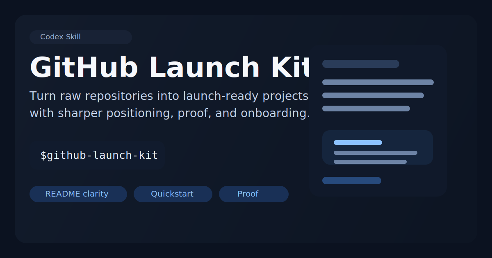

# GitHub Launch Kit

> A Codex skill for turning a useful repository into a launch-ready open-source project.



`github-launch-kit` gives Codex a practical workflow for improving the parts of a repository that shape first impressions on GitHub: positioning, README structure, quickstart clarity, proof, and launch copy.

The goal is not fake growth. The goal is a repository that is easier to understand, easier to trust, and easier to share.

## Why this skill exists

Many solid projects never get traction because the presentation is weak:

- the one-line pitch is vague
- the README starts with internals instead of value
- there is no proof, demo, or example near the top
- the quickstart is buried or too long
- launch copy is written like marketing instead of developer communication

This skill gives Codex a repeatable way to fix those issues honestly.

## What it helps with

- sharpen the repo's one-line promise
- identify launch blockers that reduce stars and shares
- rewrite or restructure the README
- improve onboarding and quickstart flow
- suggest screenshots, demos, or benchmark placements
- draft launch copy for GitHub, X, Reddit, and Hacker News
- improve contribution and community surfaces when needed

## Example prompts

```text
Use $github-launch-kit to review this repository and tell me why it is not earning stars.
```

```text
Use $github-launch-kit to rewrite my README so a new visitor understands the value in 10 seconds.
```

```text
Use $github-launch-kit to prepare this project for a public launch on GitHub and Hacker News.
```

## Repository layout

```text
github-launch-kit/
  SKILL.md
  agents/openai.yaml
  references/
    launch-checklist.md
    readme-structure.md
```

## Install

Copy the `github-launch-kit/` folder into your Codex skills directory:

```text
$CODEX_HOME/skills/github-launch-kit
```

Then invoke it explicitly with:

```text
$github-launch-kit
```

## Design principle

The skill assumes stars are usually earned through clarity and trust, not hype. If a project needs sharper scope or stronger proof, it should say that directly instead of polishing weak positioning.

## License

[MIT](./LICENSE)
